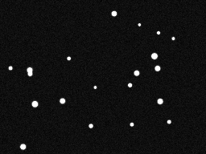
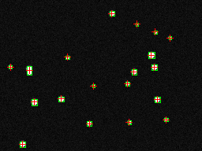

# CrowsNest (POC)

Tiny star detection playground.

The vibe:
- generate a synthetic star field
- run centroiding
- spit out clean before/after images
- benchmark + profile when things get spicy

## Quick run

```bash
poetry install
poetry run python crowsnest/poc/run.py --mode run --output-image docs/images/poc_sample.png
```

That command writes two files:
- `docs/images/poc_sample_before.png`
- `docs/images/poc_sample_after.png`

## Sample output

Example log from the current pipeline:

```text
INFO  Detected 19 stars
INFO  Before image saved to: docs/images/poc_sample_before.png
INFO  After image saved to: docs/images/poc_sample_after.png
INFO  Top 5 by flux:
INFO  id=9, x=36.712, y=88.778, flux=13187.00, pixels=57
INFO  id=5, x=191.468, y=69.535, flux=11473.00, pixels=52
INFO  id=15, x=42.964, y=129.296, flux=10717.00, pixels=47
```

### Before



### After (bounding boxes + centroid markers)



## Benchmark / profiling

```bash
make cprofile
make flamegraph
```

If you want details:

```bash
poetry run python -m crowsnest.poc.eval.profile_centroiding --cprofile-output artifacts/centroiding.prof --profile-detail
```

## Reference

- Zhang, G. (2017). *Star Identification*. https://doi.org/10.1007/978-3-662-53783-1
